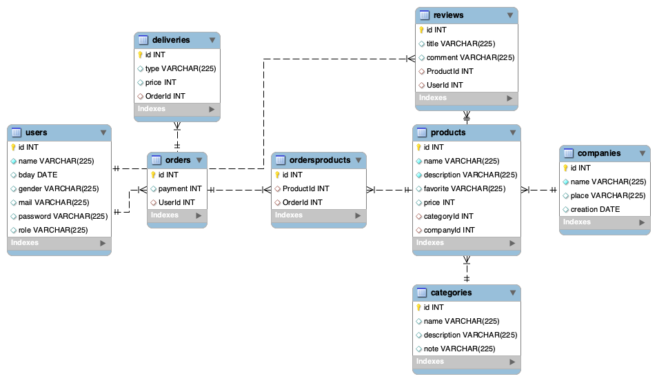

# React + Vite & Sass

This template provides a minimal setup to get React working in Vite with HMR and some ESLint rules.

Currently, two official plugins are available:

- [@vitejs/plugin-react](https://github.com/vitejs/vite-plugin-react/blob/main/packages/plugin-react/README.md) uses [Babel](https://babeljs.io/) for Fast Refresh
- [@vitejs/plugin-react-swc](https://github.com/vitejs/vite-plugin-react-swc) uses [SWC](https://swc.rs/) for Fast Refresh

 <h3 align="center">React + Vite & Sass</h3>

  

Ejercicio realizado durante la onceava semana del bootcamp para poner en práctica toda la teoría explicada durante la semana previa a las vacaciones de agosto con las tecnologías React + Vite y estilando con Sass, como parte del frontend. La parte del backend está desarrollada en otro ejercicio previo llamado <a href="https://github.com/pafz/1st_backend_project/">1st_backend_project</a> realizado en node + express, además de mysql/sequelize. Se trata de un e-commerce de una <i>Candy Shop</i>. Algunas partes del código tendrán que actualizarse para adaptarse a los parámetros del frontend.

    En este proyecto se unifica todo lo aprendido hasta ahora con la profesora Sofía Pinilla, desarrollándose el e-commerce donde los usuarios se registrarán, logearán , verán productos y crearán pedidos utilizando la API del e-commerce anteriormente mencionada.

   
    <a href="https://github.com/pafz/react-e-commerce-candy"><strong>Uso de React + Vite & Sass</strong></a>
     
    ·
    <a href="https://github.com/pafz/react-e-commerce-candy/issues">Report a Frontend Bug</a>

<!-- TABLE OF CONTENTS -->

  
Contenido

  <ol>
    <li>
      <a href="#about-the-project">About The Project</a>
      <ul>
        <li><a href="#section-components">Components</a></li>
         <li><a href="#section-implement-react-router">Implement React Router on your site</a></li>
         <li><a href="#use-context">useContext</a></li>
         <li><a href="#use-sass">Sass Style</a></li>
         <li><a href="#use-antd">Ant Design</a></li>
      </ul>   
    </li>
    <li><a href="#notes">Notes</a></li>
    <li><a href="#observations">Observations</a></li>
    <li><a href="#future-roadmap">Future map road</a></li>
    <li><a href="#preview">Preview</a></li>
    <li><a href="#links">Links</a></li>
    <li><a href="#license">License</a></li>
    <li><a href="#contact">Contact</a></li>
  </ol>

<!-- ABOUT THE OBJECTIVES -->

<view id="about-the-project">
<h1>1. <strong>Sobre el proyecto</strong></h1>

En este proyecto se repasa todo lo aprendido a lo largo de una semana sobre React + Vite & Sass, además de repasar todo lo anterior aprendido a lo largo del Bootcamp. <a href="https://docs.google.com/document/d/1toeCXTuYAT4Rf1o04xAJChIoeqmDDT62Ld7QLM3x2uU/edit">Enunciado en Google docs </a>

  <ol>
  

<strong>✺ Requisitos mínimos:</strong>
    <li>Registro de usuarios</li>
    <li>Login de usuarios</li>
    <li>Visualización de productos</li>
    <li>Añadir productos al carrito de compra</li>
    <li>Crear de pedidos</li>
    <li>Ver en el perfil los datos del usuario logueado</li>
    <li>Uso de ramas con git para cada objetivo y al acabar deben quedar solo 2 ramas <strong>Main & Develop</strong></li>
    <li>Uso de <a href="https://sass-lang.com/documentation/style-rules/" target="_blank">Sass</a> para los estilos</li>
    <li>Uso de <a href="https://ant.design/components/overview" target="_blank">Ant Design</a> para estilos predefinido</li>
        

        <strong>✺ Opcionales:</strong>
    <li>Buscador de productos por:<ul><li>texto</li><li>precio</li></ul></li>
    <li>CRUD Products</li>
    <li>Resposive</li>
    

        <strong>✺ Añadidos:</strong>
            <li>CRU_ User</li>
            <li>Delete item del carrito de compra</li>

</ol>

<ul>

</ul>
</view>

<!-- ABOUT THE PROJECT -->

<views id="section-components">
          <h2><strong>Componentes mínimos - useContext</strong></h2>
          <ul>
            <li>Register</li>
            <li>Login</li>
            <li>Home - Products</li>
            <li>Product</li>
            <li>Cart</li>
            <li>Profile - User data & Orders</li>
            <li>Header</li>
            <li>Footer</li>
          </ul>
</views>

<views id="section-implement-react-router">
          <h2><strong>Implementación de <a href="https://reactrouter.com/en/main/router-components/browser-router" target="_blank">React Router</a></strong></h2>
          <ul>
            <li>/home - de la App de los Products</li>
            <li>/login</li>
            <li>/register</li>
            <li>/profiler</li>
          </ul>
</views>

<views id="use-context">
          <h2><strong>Uso de <a href="https://es.react.dev/reference/react/useContext" target="_blank">Context</a></strong></h2>
          <ul>
            
Context proporciona una forma de pasar datos a través del árbol de componentes sin tener que pasar props manualmente en cada nivel. En una aplicación típica de React, los datos se pasan de arriba hacia abajo  a través de props.

            
Context proporciona una forma de compartir valores como estos entre los componentes sin tener que pasar explícitamente un apoyo a través de cada nivel del árbol.

            
Context está diseñado para compartir datos que pueden considerarse "globales" para un árbol de componentes de React, como el usuario autenticado actual, el tema o el idioma preferido.

          </ul>
</views>

<views id="use-sass">
          <h2><strong>Uso de <a href="https://sass-lang.com/documentation/style-rules/" target="_blank">Sass</a> style</strong></h2>
          <ul style="list-style-type: square">
          <li>Nesting selecctores</li>
          <li>Creación de variables para reutilizar <strong>$</strong></li>
          <li>Importar un bloque para reutilizar <strong>%</strong></li>
          <li>Incluir el contenido de un archivo en otro <strong>@import ""</strong></li>
          <li>Herencia, compartir un conjunto de propiedades de un selector a otro <strong>@extend %</strong></li> 
            <code>$npm i sass</code> 
            La extensión del archivo es <i>App.<u>scss</u></i> 
            </ul>
</views>

<views id="use-antd">
          <h2><strong>Uso de <a href="https://ant.design/components/overview" target="_blank">Ant Design</a></strong></h2>
          <ul>
          
antd proporciona muchos componentes de UI enriqueciendo las apps web.
 Como por ejemplo <a href="https://ant.design/components/card" target="_blank">cards</a>
          Example: react-e-commerce-candy > src > components > Cart > <i>Cart.jsx</i> 
            <code>import { Button } from 'antd';</code>
<code>import { DeleteOutlined } from '@ant-design/icons';</code> 
... 
<code>&lt;Button type="primary" className="delete_button"&gt; 
              &lt;DeleteOutlined /&gt; 
              Delete 
            &lt;/Button&gt;</code>
          </ul>
</views>
<!-- NOTES -->
<views id="notes">
          <h1>2. <strong>Notas</strong></h1>
          <ul>
            <li>Los componentes no podrán sobrepasar las 400 líneas de código.</li>
            <li>Las funciones no deberán sobrepasar las 75 líneas de código.</li>
            <li><strong>BACKEND: </strong>Para poder hacer peticiones a la API ya mencionada hay que instalar el módulo de <strong>CORS</strong>: 
En el repo del <i><a href="https://github.com/pafz/1st_backend_project/">1st_backend_project</a></i>: <code>$npm i cors</code> 
En el <i>index.js</i>:  
<code>const cors = require(“cors”);</code> 
<code>app.use(cors());</code> 
</li>
          </ul>

</views>
<!-- OBSERVATIONS -->
<views id="observations">
          <h1>3. <strong>Observaciones</strong></h1>
          <ul>
<li>Tras la descarga de proyecto, instalar modules: <code>$npm i</code></li>
<li>Correr el proyecto desde la terminal: <code>$npm run dev</code> // port assigned auto</li>
          </ul>

</views>

(<a href="README.md#top">volver al principio </a>)

<!-- FUTURE ROADMAP -->

<views id="#future-roadmap">
<h1>4. <strong>Futuro Roadmap</strong></h1>

- [ ] Multer para que el usuario puede subir <u>fotos</u> en las reviews o cambiar su foto de perfil.<a href="https://github.com/expressjs/multer/blob/master/doc/README-es.md" target="_blank"> info</a> & <a href="https://www.webslesson.info/2022/05/upload-file-in-node-js-express-using-multer.html" target="_blank">HOW TO</a>
- [ ] Multer para que el admin pueda subir <u>fotos</u> de los productos.<a href="https://github.com/expressjs/multer/blob/master/doc/README-es.md" target="_blank"> info</a> & <a href="https://www.webslesson.info/2022/05/upload-file-in-node-js-express-using-multer.html" target="_blank">HOW TO</a>
- [ ] Añadir o quitar un producto de <u>favoritos</u>.
- [ ] El usuario puede dar <u>likes</u> a las reviews de los productos.
- [ ] Que el usuario pueda añadir <u>reviews</u> a un producto (vistas en Product).
- [ ] Que solo puedas <u>editar y eliminar las reviews</u> que tu creas.
- [ ] Implementación de guards.
- [ ] More validations.
- [ ] Delete User.
- [ ] Buscador de precios descendente/ ascendente.

(<a href="README.md#top">volver al principio </a>)

</views>

<!-- PREVIEW -->

<views id="preview">
<h1>5. <strong>Vista previa</strong></h1>

ER Diagram of Candy DB in MySQL Workbench

</views>

<!-- LINKS -->

<views id="links">
          <h1>6. <strong>Links</strong></h1>

External links of interest

<a href="https://sass-lang.com/documentation/style-rules/" target="_blank">Sass</a>
<a href="https://ant.design/components/overview" target="_blank">antd</a>
<a href="https://es.piliapp.com/symbol/" target="_blank">symbols</a>

</views>

<!-- LICENSE -->

<views id="license">
<h1>7. <strong>Licencia</strong></h1>
Este proyecto ha sido realizado como trabajo de aprendizaje por Patricia Fernández.

(<a href="README.md#top">volver al principio </a>)

</views>

<!-- CONTACT -->

<views id="contact">
<h1>8. <strong>Contacta</strong></h1>

  

Patricia Fernández

(<a href="README.md#top">volver al principio </a>)

</views>
